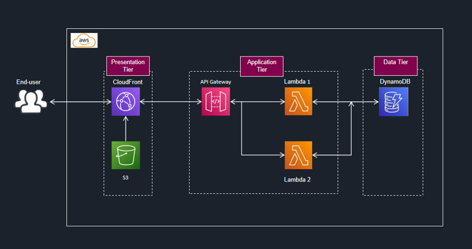

# 3-Tier Architecture Serverless in AWS

This project demonstrates a 3-tier serverless architecture using AWS.

## Tech Stack
- Cloud Front
- S3
- API Gateway
- AWS Lambda (Python)
- DynamoDB

## Architecture Diagram

## Screenshot
