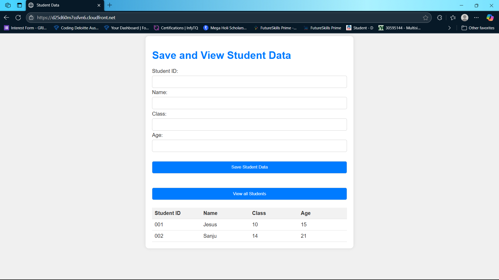

# 3-Tier Architecture Serverless in AWS

This project demonstrates how to build a 3-Tier Serverless Web Application using AWS Cloud services.

The architecture separates the application into three layers:
- Frontend Tier
- Application Logic Tier
- Database Tier

This improves scalability, security, and maintainability.

## Features
- Save student details to database.
- Retrieve and display stored student data.
- Fully serverless architecture.
- Scalable and cost-efficient.
- Global content delivery using CloudFront.

## Architecture Diagram


## Technologies Used
Presentation tier :
- **AWS Cloud Front** --> Delivers the frontend content globally with low latency using CDN.
- **AWS S3**          --> Stores and hosts the static frontend files (HTML, JS).

Application tier :
- **AWS API Gateway** --> Acts as a bridge to handle requests between frontend and backend.
- **AWS Lambda**  --> Executes backend logic for saving and retrieving student data.

Database tier :
- **AWS DynamoDB**    --> Stores student data in a scalable NoSQL database.

## Folder Structure
```
3-tier-serverless-student-app
│
├── frontend (Presentation tier)
│   ├── index.html  # Main webpage structure for entering and viewing student data
│   └── scripts.js  # Handles API calls to save and fetch student data
│
├── Application tier
│    ├── insertStudentData # Lambda function to store student data in DynamoDB
│    └── getStudentData    # Lambda function to retrieve student data from DynamoDB
```
 
## How to Run the Project
Follow these steps to run the project.

### Step 1: Clone the Repository

```bash
git clone https://github.com/Decsika-tech/3-Tier-Architecture-Serverless-in-AWS-Cloud.git
```
### Step 2: Upload Frontend to S3 (Presentation Layer)
1. Open AWS Console.
2. Create a private S3 bucket.
3. Upload the frontend files (index.html, scripts.js).
4. Enable Static Website Hosting in bucket properties.

### Step 3: Configure CloudFront
1. Create a CloudFront distribution.
2. Select the S3 bucket as the origin.
3. Deploy the distribution.
4. Use the CloudFront URL to access the web application.

### Step 4: Create DynamoDB Table (Database Layer)
1. Open DynamoDB in AWS Console.
2. Create a table named **StudentData**.
3. Set the Primary Key as: **Student Id** (String).
4. Save the table name for Lambda configuration.

### Step 5: Create IAM Role for Lambda
1. Go to AWS Console → IAM → Roles → Create Role.
2. Select Lambda as the trusted entity.
3. Attach the following permissions:
- **AmazonDynamoDBFullAccess**
- **CloudWatch Logs permissions**

Assign this role to both Lambda functions

### Step 6: Create Lambda Function (Application Layer)
Create Lambda Functions
1. Go to AWS Console → Lambda → Click **Create Function**
2. Choose **Author from scratch**

#### Lambda 1 – insertStudentData
3. Enter function name: `insertStudentData`.
4. Select runtime (Python).
5. Attach IAM Role (DynamoDB + CloudWatch access).
6. Add code to save data in DynamoDB (`PutItem`).
7. Click **Deploy**.

#### Lambda 2 – getStudentData
8. Create another function: `getStudentData`.
9. Attach same IAM Role.
10. Add code to fetch data from DynamoDB (`Scan/GetItem`).
11. Click **Deploy**.

* Test both functions using sample events.
* Check logs in CloudWatch for verification.

### Step 7: Configure API Gateway
1. Open API Gateway
2. Create a REST API
3. Create the following endpoints:
- **POST** /insertStudent
- **GET** /getStudents

Connect:
- **/insertStudentdata** → Lambda 1
- **/getStudentsdata** → Lambda 2

Enable CORS and deploy the API.

### Step 8: Update API URL in Frontend
Open the scripts.js file and update the API Gateway endpoint.

Example: 
`` 
const API_URL = "https://your-api-id.execute-api.region.amazonaws.com/prod";
``

### Step 9: Run the Application
1. Open the CloudFront URL in a browser.
2. Enter student details in the form.
3. Click Save to store the data.
4. Click View to display student records from DynamoDB.

### Step 10: Verify Data in DynamoDB
1. Open DynamoDB in AWS Console.
2. Go to the StudentData table.
3. Check the stored student records.

## Screenshot


## Future Improvements
1. Add authentication using Amazon Cognito.
2. Add update and delete operations.
3. Improve UI design.
4. Add input validation.

## Contributing
Pull requests are welcome! If you find any issues, feel free to open an issue.
